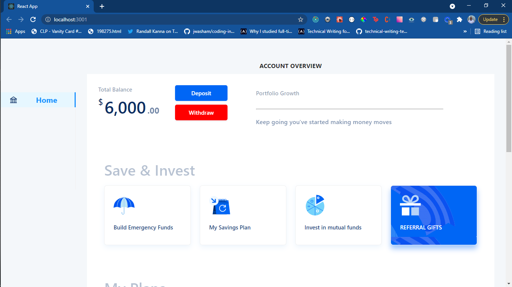
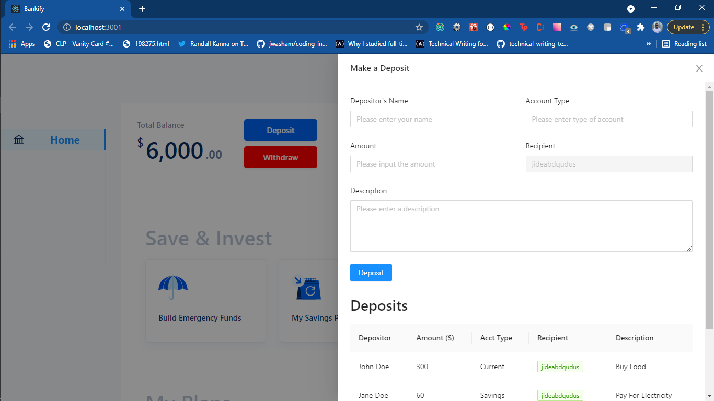

# Bankify

This project is a basic bank app that allows it's users:

- See their current account balance
- Deposit an amount into the account
- Withdraw an amount from the account

This project was bootstrapped with [Create React App](https://github.com/facebook/create-react-app), Redux for state management, Antd Reusable Components, as well as styled in SCSS.

## To use this project:

`git clone https://github.com/jideabdqudus/bankify.git`

`cd bankify`

`npm install`

`npm run start`

Note: This would run this project on port 3000 or any available port.

# What next

On viewing the app on your localhost, you get shown a dashboard

# Deposit and Withdrawal

You can Deposit and Withdraw Money from an account by clicking the buttons.

# Additons 

- You can monitor your account balance as you make a deposit and withdrawal
- If you try to withdraw more than your account balance you get an error 
- You can see a list of your withdrawals and deposits. 

The UI for this project was inspired by a [dribble design](https://dribbble.com/tags/cowrywise) 

©Jideabdquds, The Qoder